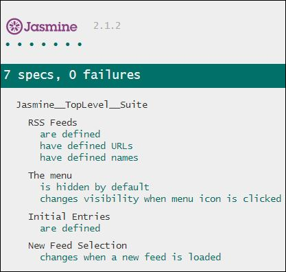

## How You Can Run This Application:
1. [Clone or download this project] (https://github.com/ChavahJ/frontend-nanodegree-feedreader/pull/new/master).
2. Open the index.html file in any browser.
3. Enjoy the pretty green lights!

## What I Did To Complete This Project:

The following text is based on the [Project Rubric](https://review.udacity.com/#!/projects/3442558598/rubric) for the Feed Reader Testing project.

1. I took the JavaScript Testing [course](https://www.udacity.com/course/ud549). It was very well done: easy to follow and informative. Thanks, Mike, you rock! 
2. I forked the [required project assets](http://github.com/udacity/frontend-nanodegree-feedreader) repository on GitHub, making sure to push to my personal branch and not the Udacity branch (a mistake I made the first time I forked a project).
3. I reviewed the functionality of the application within my browser.
4. I explored the applications different files, specifically the **index.html**, **style.css**, and **app.js** to gain an understanding of how they work.
5. I explored the Jasmine spec file, **feedreader.js**, and studied thoroughly the [Jasmine documentation](http://jasmine.github.io) for Jasmine 2.1.2. I debated upgrading to a more recent version of Jasmine by replacing the library files in my repository, but decided it wasn't necessary.
6. As per the instructions I received, I edited the `allFeeds` variable in **app.js** to make the provided test fail and saw how Jasmine visualized that failure in my application.
7. Of course, I returned the `allFeeds` variable to a passing state.
8. Then I attempted to write a test that loops through each feed in the `allFeeds` object and ensures they have defined URLs, and that the URLs were not empty. My test failed spectacularly, so I headed over to the forums to see what other students had asked. After reading through the answers, many from Karol (who is awesome!), and looking at some examples of other students' work on GitHub, I was able to create a successful test.
9. Once I had the URL test written, it was easy to write a test that loops through each feed in the `allFeeds` object to ensure that all the names were defined and not empty.
10. Then I wrote the remaining test suites, including `"The Menu"`, `"Initial Entries"`, and `"New Feed Selection"`.
11. Within `"The Menu"` suite I wrote a test to ensure that the menu element is hidden by default. I examined the menu-icon functionality in Chrome Dev Tools (as recommended by Karol in the forums), and saw that when the menu is hidden, the body tag has a class called "menu-hidden". When the menu appears, that class disappears.
12. I wrote a second test to ensure that the menu changes visibility when the menu icon is clicked. This test has two expectations: does the menu display when clicked and does it hide when clicked again.
13. Then within `"Initial Entries"` I wrote a test to ensure that when the `loadFeed` function is called and completes its work, there is at least a single `.entry` element within the `.feed` container. This was a bit trickier because I had to ensure the callback occurred asynchronously. 
14. Within the `"New Feed Selection"` suite, I wrote a test to ensure that the content actually changes when a new feed is loaded by the `loadFeed` function. This was the most difficult of the tests to write. I hit the forums again to see what others had asked about, and went back to the Jasmine documentation for further clarity. 
15. Finally, I created this beautiful README file, detailing all steps required to successfully run the application and all the steps I took to complete this project.
